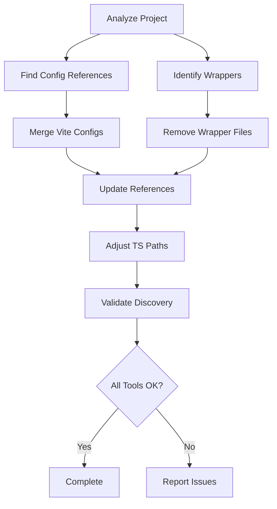

# Design Document: Config Consolidation

## Overview

This design consolidates duplicate configuration files by removing wrapper files from the root directory and ensuring all build tools reference configurations in the config/ directory. The approach involves analyzing file relationships, merging duplicate configurations (particularly vite.config.ts), updating tool references, and validating that all tools can discover their configurations post-consolidation.

The consolidation will be performed through a systematic process:
1. Identify and remove simple wrapper files
2. Merge vite.config.ts files intelligently
3. Update package.json and tool configurations
4. Adjust TypeScript configuration paths
5. Validate tool configuration discovery

## Architecture

### Component Structure

```
config-consolidation/
├── analyzer/
│   ├── ConfigFileAnalyzer      # Identifies wrapper files and duplicates
│   └── DependencyScanner       # Finds all references to config files
├── consolidator/
│   ├── WrapperRemover          # Removes simple re-export wrappers
│   ├── ViteConfigMerger        # Merges vite.config.ts intelligently
│   └── TsConfigAdjuster        # Adjusts TypeScript path aliases
├── updater/
│   ├── PackageJsonUpdater      # Updates scripts and tool configs
│   └── ToolConfigUpdater       # Updates tool-specific settings
└── validator/
    └── ConfigDiscoveryValidator # Tests tool config discovery
```

### Data Flow



## Components and Interfaces

### ConfigFileAnalyzer

Analyzes configuration files to identify wrappers and duplicates.

```typescript
interface ConfigFileInfo {
  path: string;
  isWrapper: boolean;
  reExportsFrom: string | null;
  content: string;
}

class ConfigFileAnalyzer {
  analyzeFile(filePath: string): ConfigFileInfo;
  isWrapperFile(content: string): boolean;
  findDuplicates(rootPath: string, configPath: string): string[];
}
```

### DependencyScanner

Scans the project for references to configuration files.

```typescript
interface ConfigReference {
  file: string;
  line: number;
  type: 'import' | 'script' | 'tool-config';
  referencedPath: string;
}

class DependencyScanner {
  scanPackageJson(): ConfigReference[];
  scanSourceFiles(pattern: string): ConfigReference[];
  findAllReferences(configFile: string): ConfigReference[];
}
```

### WrapperRemover

Removes wrapper configuration files after validation.

```typescript
interface RemovalResult {
  removed: string[];
  errors: Array<{file: string; error: string}>;
}

class WrapperRemover {
  removeWrappers(wrappers: string[]): RemovalResult;
  validateRemoval(file: string): boolean;
}
```

### ViteConfigMerger

Intelligently merges two vite.config.ts files.

```typescript
interface ViteConfigComparison {
  rootOnly: string[];      // Features only in root
  configOnly: string[];    // Features only in config/
  conflicts: string[];     // Conflicting settings
  merged: string;          // Merged configuration
}

class ViteConfigMerger {
  compareConfigs(rootPath: string, configPath: string): ViteConfigComparison;
  mergeConfigs(comparison: ViteConfigComparison): string;
  preserveFeatures(config1: any, config2: any): any;
}
```

### TsConfigAdjuster

Adjusts TypeScript configuration path aliases based on file location.

```typescript
interface PathAdjustment {
  original: string;
  adjusted: string;
  reason: string;
}

class TsConfigAdjuster {
  adjustPaths(tsconfig: any, fromDir: string, toDir: string): PathAdjustment[];
  validatePaths(tsconfig: any, baseDir: string): boolean;
}
```

### PackageJsonUpdater

Updates package.json scripts and tool configurations.

```typescript
interface UpdateResult {
  updated: string[];
  unchanged: string[];
  errors: string[];
}

class PackageJsonUpdater {
  updateScripts(configMapping: Map<string, string>): UpdateResult;
  addToolConfigs(tools: string[]): UpdateResult;
}
```

### ToolConfigUpdater

Updates tool-specific configuration settings.

```typescript
interface ToolConfig {
  tool: string;
  configPath: string;
  discoveryMethod: 'auto' | 'package.json' | 'cli-flag';
}

class ToolConfigUpdater {
  configureEslint(configPath: string): ToolConfig;
  configureVite(configPath: string): ToolConfig;
  configureTailwind(configPath: string): ToolConfig;
  configurePostCSS(configPath: string): ToolConfig;
}
```

### ConfigDiscoveryValidator

Validates that tools can discover their configurations.

```typescript
interface ValidationResult {
  tool: string;
  configFound: boolean;
  configPath: string | null;
  error: string | null;
}

class ConfigDiscoveryValidator {
  validateEslint(): ValidationResult;
  validateVite(): ValidationResult;
  validateTypeScript(): ValidationResult;
  validatePostCSS(): ValidationResult;
  validateTailwind(): ValidationResult;
  validateAll(): ValidationResult[];
}
```

## Data Models

### Configuration File Mapping

```typescript
interface ConfigMapping {
  tool: string;
  rootPath: string | null;      // Path in root (if exists)
  configPath: string;            // Path in config/
  isWrapper: boolean;            // Is root file a wrapper?
  action: 'remove' | 'merge' | 'keep' | 'adjust';
}

// Example mappings
const configMappings: ConfigMapping[] = [
  {
    tool: 'eslint',
    rootPath: 'eslint.config.js',
    configPath: 'config/eslint.config.js',
    isWrapper: true,
    action: 'remove'
  },
  {
    tool: 'vite',
    rootPath: 'vite.config.ts',
    configPath: 'config/vite.config.ts',
    isWrapper: false,
    action: 'merge'
  },
  {
    tool: 'typescript',
    rootPath: 'tsconfig.json',
    configPath: 'config/tsconfig.json',
    isWrapper: false,
    action: 'adjust'
  }
];
```

### Vite Configuration Merge Strategy

```typescript
interface ViteMergeStrategy {
  plugins: 'union';              // Combine all plugins
  server: 'prefer-root';         // Root has PWA-specific settings
  resolve: 'prefer-config';      // Config has correct relative paths
  build: 'merge-deep';           // Merge build options deeply
  optimizeDeps: 'union';         // Combine optimization deps
}
```

### Tool Discovery Configuration

```typescript
interface ToolDiscoveryConfig {
  eslint: {
    method: 'cli-flag';
    flag: '--config';
    path: 'config/eslint.config.js';
  };
  vite: {
    method: 'cli-flag';
    flag: '--config';
    path: 'config/vite.config.ts';
  };
  tailwind: {
    method: 'package.json';
    field: 'tailwindcss.config';
    path: './config/tailwind.config.ts';
  };
  postcss: {
    method: 'package.json';
    field: 'postcss';
    path: './config/postcss.config.js';
  };
  typescript: {
    method: 'cli-flag';
    flag: '--project';
    path: 'tsconfig.json';  // Keep in root for tool compatibility
  };
}
```


## Correctness Properties

A property is a characteristic or behavior that should hold true across all valid executions of a system—essentially, a formal statement about what the system should do. Properties serve as the bridge between human-readable specifications and machine-verifiable correctness guarantees.

### Property 1: Wrapper File Identification

*For any* configuration file in the root directory, if it contains only an import statement and a re-export statement, then the analyzer should identify it as a wrapper file.

**Validates: Requirements 1.1, 1.2**

### Property 2: Wrapper Removal Preserves Targets

*For any* set of wrapper files, when they are removed, all corresponding target files in the config/ directory should remain unchanged and intact.

**Validates: Requirements 1.3, 1.4**

### Property 3: Config Difference Detection

*For any* pair of configuration files (root and config/ versions), the comparison function should identify all structural differences including plugins, settings, and path configurations.

**Validates: Requirements 2.1**

### Property 4: Merge Preserves All Features

*For any* two configuration files being merged, the resulting merged configuration should contain all unique plugins, build settings, path aliases, and features from both source files.

**Validates: Requirements 2.2, 7.1, 7.2, 7.3, 7.4**

### Property 5: Conflict Resolution Consistency

*For any* configuration merge where conflicts exist, the conflict resolution should consistently apply the same strategy (preferring the more feature-complete version) across all conflict types.

**Validates: Requirements 7.5**

### Property 6: Package.json Path Updates

*For any* package.json script that references a root config file path, the updater should transform it to reference the corresponding config/ directory path while preserving script functionality.

**Validates: Requirements 4.1, 4.2**

### Property 7: TypeScript Path Adjustment

*For any* TypeScript path alias, when moving a tsconfig file from one directory to another, the adjusted path should resolve to the same absolute location as the original path.

**Validates: Requirements 5.2**

### Property 8: Project Reference Validation

*For any* tsconfig.json with project references, all referenced files should exist at their specified paths and the paths should be valid relative to the tsconfig location.

**Validates: Requirements 5.3**

### Property 9: Tool Configuration Validation

*For any* build tool (ESLint, Vite, TypeScript, PostCSS, Tailwind), the validator should correctly determine whether the tool can locate its configuration file and report the specific tool and path if not found.

**Validates: Requirements 6.1, 6.2, 6.3, 6.4, 6.5, 6.6**

### Property 10: Fallback Configuration Completeness

*For any* tool that cannot auto-discover its config in config/, the system should provide a valid fallback configuration method (package.json field or CLI flag) that allows the tool to locate its configuration.

**Validates: Requirements 3.6**

## Error Handling

### File System Errors

- **File Not Found**: If a configuration file doesn't exist at the expected path, log a warning and skip that file
- **Permission Denied**: If file operations fail due to permissions, report the error with the specific file path and operation
- **Invalid JSON/Config**: If a configuration file cannot be parsed, report the syntax error with line number

### Merge Conflicts

- **Incompatible Plugins**: If two plugins conflict (same plugin with different versions), prefer the newer version and log a warning
- **Path Resolution Failures**: If a path cannot be resolved after adjustment, keep the original path and log an error
- **Missing Dependencies**: If a merged config references dependencies not in package.json, log a warning

### Validation Failures

- **Tool Cannot Find Config**: Report which tool failed and suggest configuration methods
- **Invalid Config Path**: If a config path in package.json is invalid, report the error and suggest correction
- **Broken References**: If tsconfig project references are broken, report the missing files

### Rollback Strategy

If validation fails after consolidation:
1. Restore all removed wrapper files from backup
2. Restore original vite.config.ts if merge failed
3. Revert package.json changes
4. Report all validation errors to user

## Testing Strategy

### Unit Testing

Unit tests will focus on specific examples and edge cases:

- **Wrapper Detection**: Test files with various import/export patterns
- **Path Transformation**: Test path adjustments with different relative paths
- **Merge Logic**: Test merging configs with specific feature combinations
- **Validation Logic**: Test validator with known config locations

### Property-Based Testing

Property-based tests will verify universal properties across all inputs using a property-based testing library (fast-check for TypeScript/JavaScript). Each test will run a minimum of 100 iterations.

- **Property 1**: Generate random file contents and verify wrapper detection
  - **Feature: config-consolidation, Property 1: Wrapper File Identification**

- **Property 2**: Generate random wrapper sets and verify target preservation
  - **Feature: config-consolidation, Property 2: Wrapper Removal Preserves Targets**

- **Property 3**: Generate random config pairs and verify difference detection
  - **Feature: config-consolidation, Property 3: Config Difference Detection**

- **Property 4**: Generate random config pairs and verify feature preservation in merge
  - **Feature: config-consolidation, Property 4: Merge Preserves All Features**

- **Property 5**: Generate configs with conflicts and verify consistent resolution
  - **Feature: config-consolidation, Property 5: Conflict Resolution Consistency**

- **Property 6**: Generate random package.json scripts and verify path updates
  - **Feature: config-consolidation, Property 6: Package.json Path Updates**

- **Property 7**: Generate random path aliases and verify adjustment correctness
  - **Feature: config-consolidation, Property 7: TypeScript Path Adjustment**

- **Property 8**: Generate tsconfig with references and verify validation
  - **Feature: config-consolidation, Property 8: Project Reference Validation**

- **Property 9**: Generate random tool configurations and verify validation logic
  - **Feature: config-consolidation, Property 9: Tool Configuration Validation**

- **Property 10**: Generate tool configs without auto-discovery and verify fallbacks
  - **Feature: config-consolidation, Property 10: Fallback Configuration Completeness**

### Integration Testing

Integration tests will verify the complete consolidation workflow:

- Run consolidation on a test project structure
- Verify all tools can actually find and load their configurations
- Run build commands to ensure functionality is preserved
- Test rollback mechanism if validation fails

### Testing Balance

Unit tests provide concrete examples and catch specific bugs, while property-based tests verify general correctness across many generated inputs. Together they provide comprehensive coverage without excessive redundancy.
